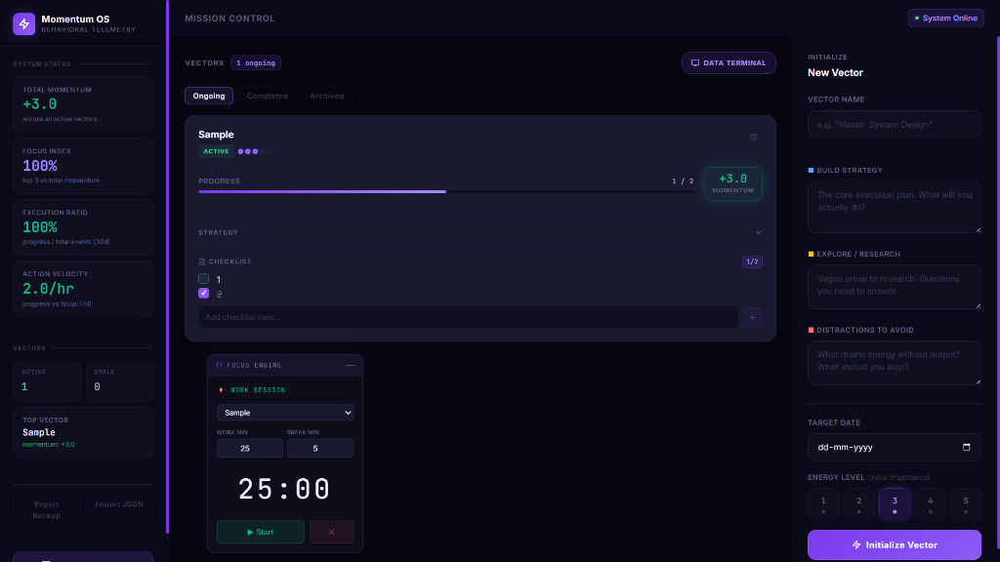

# Momentum OS

**Momentum OS** is a professional-grade, local-first behavioral telemetry system designed for continuous forward motion. It evolves the concept of a "habit tracker" into a clinical, data-driven operating system for managing complex goals (Vectors) and quantifying execution momentum.



## ⚡ Core Philosophy: Vectors vs Tasks

Traditional to-do lists focus on binary completion. Momentum OS focuses on **Vectors**:
- **Vectors:** Strategic directions composed of Build, Explore, and Avoid strategies.
- **Momentum:** A self-decaying metric that rewards daily consistency over sporadic bursts.
- **Action Velocity:** A precise calculation of `(Progress Events) / (Effective Focus Hours)`.

## 🛠️ Key Features

- **Draggable Focus Engine:** A floating Pomodoro timer that appends focus data directly to your active Vectors.
- **Integrated Data Terminal:** Full-screen dashboard with Recharts visualization for activity timelines, vector distribution, and task volume.
- **Strategic AI Audit:** Built-in `puter.js` integration for deep behavioral analysis and automated clinical feedback on your progress.
- **Privacy First:** local-first architecture. All data stays in `localStorage` with built-in export/import JSON portability.
- **Cyberpunk Aesthetic:** Deep indigo palette, glassmorphism, and high-contrast telemetry indicators.

## 📊 The Math Engine

Momentum OS uses "Ironclad Math" to prevent exploit habits:
- **Momentum Decay:** Scores drop automatically if no progress events occur within a 5-day window.
- **Execution Ratio:** Measures your decisiveness vs. hesitation by comparing `Progress` vs. `Regress` events.
- **Focus Index:** Calculates resource allocation by analyzing the momentum density of your top 3 vectors.

## 🚀 Getting Started

### Prerequisites
- Node.js (v18+)
- npm or yarn

### Installation
1. Clone the repository:
   ```bash
   git clone https://github.com/DakshGarg-19/Momentum-OS.git
   cd MomentumOS
   ```
2. Install dependencies:
   ```bash
   npm install
   ```
3. Run the development server:
   ```bash
   npm run dev
   ```

## 🏗️ Architecture

- **Frontend:** Vite + React + TailwindCSS v4
- **Charts:** Recharts
- **State Management:** Custom `useMomentumDB` hook + Context API
- **AI Analytics:** Puter.js SDK
- **Draggable UI:** React-Draggable

## 📜 Technical Logic Guide

For a deep dive into the mathematical formulas and data structures, refer to the [Master Architecture Guide](./master_architecture_guide.md).

---

Built with ⚡ by [Daksh Garg](https://github.com/DakshGarg-19)
